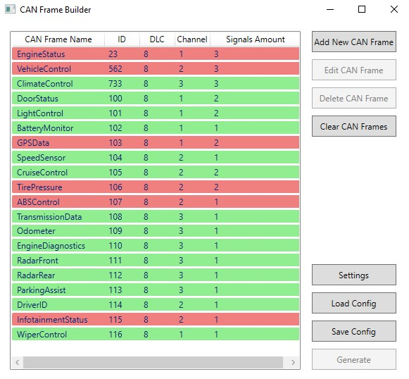
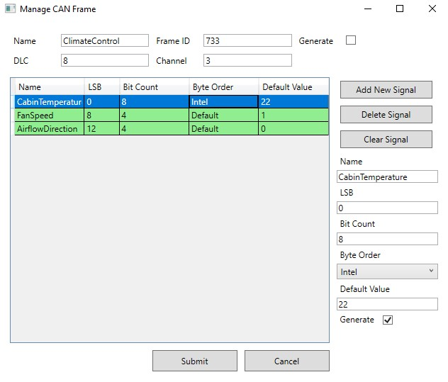

# CAN Frame Builder
## About  
This repository contains a .NET WPF application designed to streamline the generation of source code for CANoe Testing within the .NET Framework. The application provides a user-friendly interface to define and describe the structure of CAN frames and generates .cs classes that are ready for integration into your testing environment.

### Key Features  
- **Define CAN Frame Structure**:  
  Easily input details about the CAN frame, including:  
  - **Name**: Name of the CAN frame.  
  - **DLC**: Data Length Code.  
  - **Channel**: CAN communication channel.  
  - **ID**: Frame identifier.  

- **Signal Description**:  
  Precisely describe individual signals within the CAN frame:  
  - **Signal Name**: Identifier for the signal.  
  - **LSB**: Least significant bits.  
  - **Bit Count**: Total bits used by the signal.  
  - **Byte Order**: Endianness (Big-Endian or Little-Endian).  

- **Create, Edit, and Manage Frames**:  
  Add new CAN frames and signals. 
  Edit existing frames with deep clone functionality.
  Delete individual frames or clear all frames.

- **Code Generation**:  
  Choose an output path, and the application generates `.cs` classes that extend CAN frames. These classes are optimized for seamless integration into the testing environment.  
  Classes are optimized for seamless integration into testing environments.

- **Save and Load Configurations**:  
  - Save entered data to a `.json` file for future use.  
  - Load previously saved configurations for quick modifications or re-generation.  

- **Example Configurations**:  
  An `Example` folder is included in the repository, containing sample `.json` configuration files. These examples demonstrate how to define CAN frames and signals, providing a helpful starting point for new users.  
  Over 20 predefined CAN frames demonstrating full use cases.

#### Example CAN Frame Definition  

#### Example Settings 

### Why Use This Application?  
This tool eliminates the repetitive and error-prone task of manually writing source code for CANoe Testing. By automating code generation, it enhances productivity, reduces the risk of errors, and simplifies the process of adapting to new or updated CAN frame structures.  

## Application Structure

- **Model**
  - Defines the data structures for CAN Frames, Signals, and Settings.
- **View**
  - Contains the WPF UI components (Windows, Dialogs).
- **ViewModel**
  - Manages logic and interaction between View and Model.
  - `MainWindowViewModel` handles Add, Edit, Delete, Clear, Load Config, and Settings commands with RelayCommand bindings.
- **Utility**
  - JSONHandler for configuration file operations.

## Technologies

- .NET 8.0
- WPF (Windows Presentation Foundation)
- MVVM Architecture
- JSON Serialization/Deserialization
